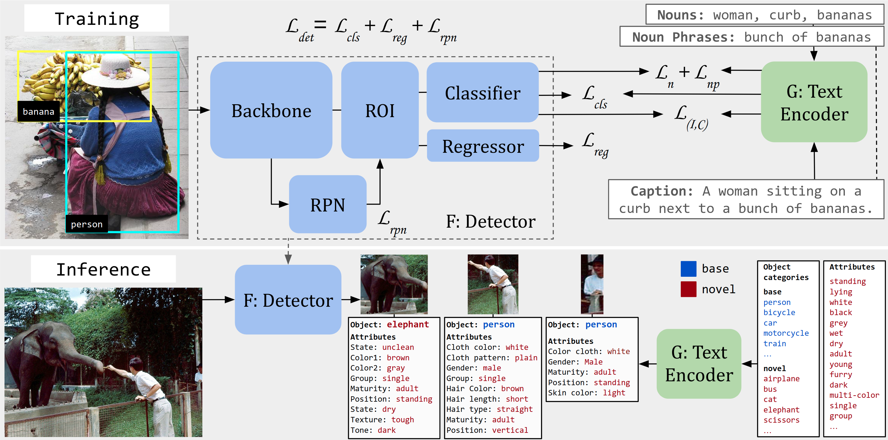

# OVAD: Open-vocabulary Attribute Detection

## News
**2023-06** (v0.1): This repository is the official PyTorch implementation of our [paper](https://ovad-benchmark.github.io/).
**2023-02** OVAD has been accepted by CVPR 2023! [paper](https://openaccess.thecvf.com/content/CVPR2023/papers/Bravo_Open-Vocabulary_Attribute_Detection_CVPR_2023_paper.pdf)
**2022-11** Dataset visualizer page release [page](https://lmb.informatik.uni-freiburg.de/resources/datasets/ovad/).
**2022-11** Project page release [page](https://ovad-benchmark.github.io/).
**2022-11** Arxiv paper release

## Table of Contents
* [News](#news)
* [Table of Contents](#table-of-contents)
* [Installation](#installation)
    * [Requirements](#requirements)
    * [Example conda environment setup](#example-conda-environment-setup)
* [Prepare datasets](#prepare-datasets)
    * [Download datasets](#download-datasets)
    * [Filter annotations to separate base and novel classes](#filter-annotations-to-separate-base-and-novel-classes)
    * [Extract the OVAD-box instances from the annotations for the box oracle evaluation](#extract-the-ovad-box-instances-from-the-annotations-for-the-box-oracle-evaluation)
    * [Precompute the text features](#precompute-the-text-features)
* [Open Vocabulary Detection Benchmark](#open-vocabulary-detection-benchmark)
    * [Box Setup Vision Language Models](#box-setup-vision-language-models)
    * [Detection Setup OVD Models](#detection-setup-ovd-models)
        * [Train](#train)
        * [Evaluate](#evaluate)
        * [Benchmark results](#benchmark-results)
* [Acknowledgements](#acknowledgements)
* [License](#license)
* [Citation](#citation)

## Installation
### Requirements
- Linux or macOS with Python ≥ 3.6
- PyTorch ≥ 1.8.
  Install them together at [pytorch.org](https://pytorch.org) to make sure of this. Note, please check the
  PyTorch version matches the one required by Detectron2 and your CUDA version.
- Detectron2: follow [Detectron2 installation instructions](https://detectron2.readthedocs.io/tutorials/install.html).

Originally the code was tested on `python=3.8.13`, `torch=1.10.0`, `cuda=11.2` and OS `Ubuntu 20.04`.

### Example conda environment setup
~~~bash
conda create --name ovad_env python=3.8 -y
conda activate ovad_env

# install PyTorch and Detectron2 from previous section
# under your working directory
git clone https://github.com/OVAD-Benchmark/ovad-benchmark-code.git
cd ovad-benchmark-code
pip install -r requirements.txt
~~~

## Prepare datasets
### Download datasets
The basic functions of our code use [COCO](https://cocodataset.org/) images and our annotations of the [OVAD benchmark](https://lmb.informatik.uni-freiburg.de/resources/datasets/ovad.zip). 
Download the dataset from the official website use sim-link under `$datasets/`.
```
datasets/
    coco/
        train2017/
        val2017/
        annotations/
            captions_train2017.json
            instances_train2017.json 
            instances_val2017.json
    ovad/
        ovad2000.json
        ovad_evaluator.py
        ovad.py
        README.md
```
### Filter annotations to separate base and novel classes
~~~bash
python tools/make_ovd_json.py --base_novel base --json_path datasets/coco/annotations/instances_train2017.json
python tools/make_ovd_json.py --base_novel base_novel17 --json_path datasets/coco/annotations/instances_val2017.json
~~~

This generates two new annotation json files
`$datasets/coco/annotations/instances_train2017_base.json` training file with only base class (48) annotations
`$datasets/coco/annotations/instances_val2017_base_novel17.json` validation file with base (48) and novel17 (17) class annotations

### Extract the OVAD-box instances from the annotations for the box oracle evaluation
~~~bash
python tools/extract_obj_boxes.py
~~~

This should generate a new folder under `$datasets/`.

```
datasets/
    ovad_box_instances/
        2000_img/
            bb_images/
            bb_labels/
                ovad_4fold_ids.pkl  
                ovad_labels.pkl
```

### Precompute the text features
Compute and save the noun and attribute text features for the OVAD benchmark. Or download them from [link](https://lmb.informatik.uni-freiburg.de/resources/datasets/ovad/ovad_text_emb.zip) and place them under `$datasets/text_representations`.

~~~bash
python tools/dump_attribute_features.py --out_dir datasets/text_representations   \
      --save_obj_categories --save_att_categories --fix_space \
      --prompt none \
      --avg_synonyms --not_use_object --prompt_att none 
~~~
This should generate a new folder under `$datasets/`.

```
datasets/
    text_representations/
        ovad_att_clip-ViT-B32_+catt.npy
        ovad_att_clip-ViT-B32_+catt.pkl
        ovad_obj_cls_clipViT-B32_none+cname.npy
        ovad_obj_cls_clipViT-B32_none+cname.pkl
```
## Open Vocabulary Detection Benchmark
### Box Setup Vision Language Models
Evaluate Vision Language Models using the Box object setup
Clone the respective repositories under `$ovamc/`, [CLIP](https://github.com/openai/CLIP), [Open Clip](https://github.com/mlfoundations/open_clip), [ALBEF](https://github.com/salesforce/ALBEF), [BLIP](https://github.com/salesforce/BLIP), [BLIP2](https://github.com/salesforce/LAVIS), [X-VLM](https://github.com/zengyan-97/X-VLM)
Run the evaluation commands. Flags selected correspond to the best model and prompt configuration for every case of model. 
~~~bash
# CLIP
python ovamc/ova_clip.py --model_arch "ViT-B/16" -bs 50 --prompt all
# Open CLIP
python ovamc/ova_open_clip.py --model_arch "ViT-B-32" -bs 50  --pretrained laion2b_e16 --prompt a
# ALBEF
python ovamc/ova_albef.py --model_arch "cocoGrounding" -bs 50 --prompt the --average_syn
# BLIP
python ovamc/ova_blip.py --model_arch "baseRetrieval" -bs 50 --prompt the
# BLIP 2
python ovamc/ova_blip2.py --model_arch "base_coco" -bs 50 --prompt the
# X-VLM
python ovamc/ova_xvlm.py --model_arch "pretrained16M2" -bs 50 --prompt all --average_syn
~~~

Results

| Model  | ALL mAP | HEAD | MEDIUM | TAIL |
| ------------- | ------------- | ------------- | ------------- | ------------- |
| CLIP  | 16.55 | 43.87 | 18.56 | 4.39 |
| Open CLIP  | 16.97 | 44.30 | 18.45 | 5.46 |
| ALBEF  | 21.04 | 44.18 | 23.83 | 9.39 |
| BLIP  | 24.29 | 50.99 | 28.46 | 9.69 |
| BLIP 2  | 25.5 | 49.75 | 30.45 | 10.84 |
| X-VLM  | 27.99 | 49.7 | 34.1 | 12.8 |

### Detection Setup OVD Models
Model Outline
<p align="center"></p>

#### Train
TODO: To be added soon

#### Evaluate
Download the pretrained [OVAD Baseline model](https://lmb.informatik.uni-freiburg.de/resources/datasets/ovad/OVAD_baseline.pth) and place it under `$models/`
```
    models/
        OVAD_baseline.pth
```

~~~bash
# OVAD Baseline
python train_att_net.py --num-gpus 1 --resume \
--eval-only --config-file configs/Base_OVAD_C4_1x_average_att.yaml \
MODEL.WEIGHTS models/OVAD_baseline.pth 

# OVAD Baseline Box Oracle
python train_att_net.py --num-gpus 1 --resume \
--eval-only --config-file configs/BoxAnn_OVAD_C4_1x.yaml \
MODEL.WEIGHTS models/OVAD_baseline.pth
~~~

#### Benchmark results
Attribute results mAP for the given model weights

| Model / Att Type | Chance     | *OVAD Baseline*    |
| ---------------- | ---------- | ----------- |
| all              | 8.610      | 20.134      |
| head             | 36.005     | 46.577      |
| medium           | 7.329      | 24.580      |
| tail             | 0.614      | 5.298       |

Object results AP50 Generalized (OVD-80) - 2,000 images

|  Model  |  Novel (32)  |  Base (48)  |  All (80)  |
| --------------- | -------------- | --------------- | --------------------- |
| *OVAD Baseline* |     24.557     |     50.396      |        40.061         |

Object results AP50 Generalized (OVD) - 4,836 images

|  Model  |  Novel (17)  |  Base (48)  |  All (65)  |
| --------------- | -------------- | --------------- | --------------------- |
| *OVAD Baseline* |     29.757     |     49.355      |        44.229         |

## Acknowledgements
For the full references see our [paper](https://openaccess.thecvf.com/content/CVPR2023/papers/Bravo_Open-Vocabulary_Attribute_Detection_CVPR_2023_paper.pdf). We especially thank the creators of the following github repositories for providing helpful code:

- Zhou et al. for their open vocabulary model and code. Our code is in great portion based on this repository: [Detic](https://github.com/facebookresearch/Detic) 
- Zareian et al. for their open-vocabulary setup and code: [OVR-CNN](https://github.com/alirezazareian/ovr-cnn)
- Radford et al. for their [Clip](https://github.com/openai/CLIP) model and code.

## License
[Creative Commons License](LICENSE)

## Citation
If you're using OVAD dataset or code in your research or applications, please cite using this BibTeX:
```bibtex
@InProceedings{Bravo_2023_CVPR,
    author    = {Bravo, Mar{\'\i}a A. and Mittal, Sudhanshu and Ging, Simon and Brox, Thomas},
    title     = {Open-Vocabulary Attribute Detection},
    booktitle = {Proceedings of the IEEE/CVF Conference on Computer Vision and Pattern Recognition (CVPR)},
    month     = {June},
    year      = {2023},
    pages     = {7041-7050}
}
```
